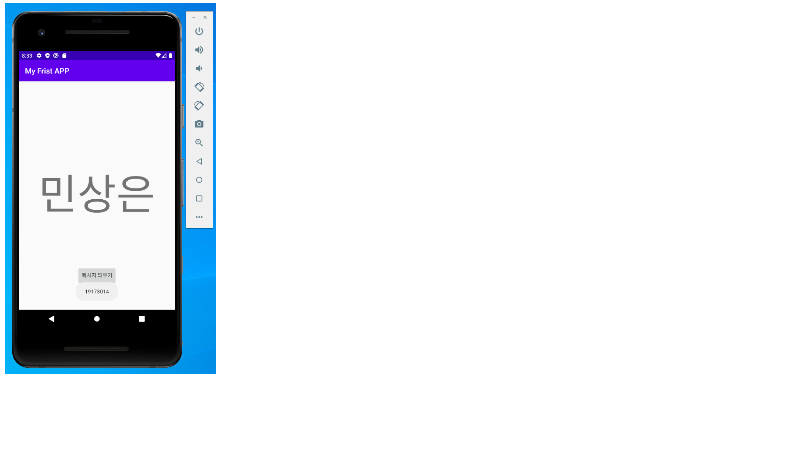
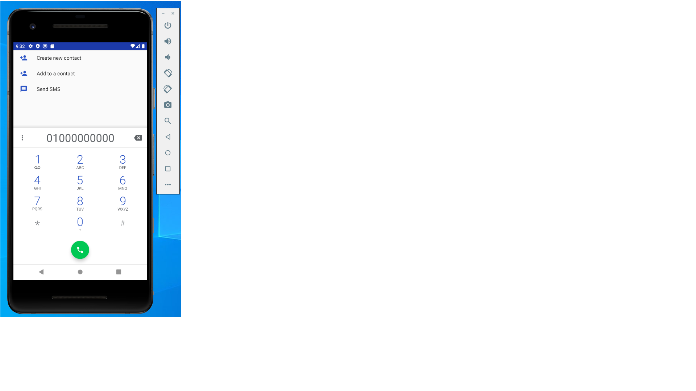

# 19173014 민상은

## 1주차 과제
quiz

## 2주차 과제
</img>

## 3주차 과제
</img>
</img>

## 4주차 과제
-아이디어 명: 개인 맞춤 화장품 앱

요즘 '넷플릭스'와 같이 빅데이터 마케팅을 이용해 개인 맞춤 서비스를 제공하고 있습니다.
여기에 아이디어를 얻어 화장품도 자신이 자주 사용하는 화장품의 브랜드, 모델 등을 설정해 놓으면 거기에 맞춰 적절한 가격, 그 제품의 비슷한 성분이 들어간 다른 제품을 알려주기, 자신의 주변에서 가장 가까운 매장 등을 알려주는 것입니다. 또한 화장품의 사용하는 기간과 내가 자주쓰는 화장을 설정해 놓으면 그 시기에 맞추어 화장품을 다시 사야할 시간이라는 알림이 뜨며, 내가 설정해 놓은 화장품들이 미리 카트에 들어가 있게 해 다시 화장품을 찾는 번거러움을 없애는 것입니다. 뿐만 아니라 요즘 유튜브에서 유명 뷰티 크리에이터가 사용하는 화장품 제품을 바로 볼 수 있는 앱입니다.

## 5주차 과제
-숭의여자대학교LMS에 과제 제출함.

## 7주차 과제
</img>
</img>

## 9주차 과제
</img>
</img>
</img>
